# Самодельный стратостат. Часть 3


Те из вас, кто читал предыдущие части моей истории, сейчас наверняка пристально разглядывают эту картинку и у них в голове появляются вопросы. Если вы присоединились только к 3-й части - все равно запрыгивайте, будет интересно и будут ссылки на прошлые части. Как можно догадаться - мы снова это сделали. Мы запустили свой самодельный стратостат из жвачки и картофельных батареек, и привезли немного интересного из стратосферы. Хотите узнать почему это фото именно такое? Поехали!

## Вступление

[Самодельный стратостат. Часть 1](https://habr.com/ru/post/555070/)

[Самодельный стратостат. Часть 2](https://habr.com/ru/post/577184/)

Да потому, что мы сделали запуск ночью... Мы, конечно, не планировали запуск ночью, но "человек предполагает, а COVID располагает"... Так что расписание наше пришлось подвинуть, пока все не перестали кашлять и запуск сдвинулся на будний день. А там у всех дневная работа, заботы и т.п. Перенести на ближайшие выходные не получилось уже из-за меня - мне надо было срочно улетать домой. В общем - это был вечер буднего дня.

> По секрету скажу (я эту мысль никому из команды ранее не озвучивал, иначе меня засмеяли бы), что у меня была идея запустить ночью, *когда-нибудь*. Я, почему-то, думал, что GoPro вытащит неплохой ночной вид на видео. Но, как вы понимаете, не вытащила, хоть и снимала с максимальным для нее ISO 1600. Хотя фото это мне нравится - на нем Луна :-)

Все! На этом можно заканчивать! Да нет, конечно. У меня опять получился какой-то лонг-рид: я расскажу как все было и почему все было именно так.

Для начала небольшое отступление для вновь подключившихся. Около года назад мы с друзьями решили собрать свое *нечто*, способное подняться на высоту 30+ км, записать там видео и некоторые данные, вроде влажности, температур, давления и т.п. Мы назвали это *самодельный стратостат*. В первой части статьи приведен подробный план постройки этого аппарата (все этапы). Во второй части мы учли некоторые ошибки прошлого и повторили запуск(-и). 3апускали мы 3 раза, всего было 4 шара, улетело из них на тот момент - 2. И вот, наш 4-й запуск, в который полетел, улетел и прилетел наш 5-й шар - **Vostok-4** (да-да, naming convention описан во второй части статьи).

Вцелом, всю нашу историю за прошедший год можно изобразить вот этой совершенной инфографикой:
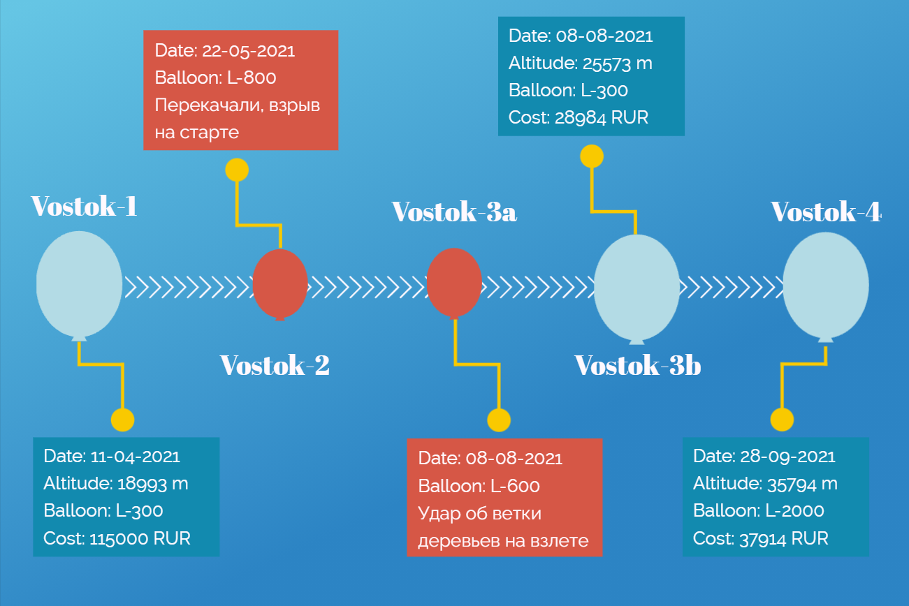

Да, вы снова видите эту цифру: **35794м**. И на фотке из заголовка она, и тут она. Все верно. Но обо всем по порядку.

## Конструкция

### Общая конструкция

Хоть я и обещал в прошлый раз, что технических изменений не будет, но, как говорится - еще ни один план не пережил начало битвы. А битва у нас случилась с парашютом. Дело в том, что за все наши запуски наш самый первый парашют поистрепался. Я упоминал уже, что, даже после первого запуска, он немного надорвался на внутренней поверхности купола. Повреждение было не критичным и мы запустились с ним еще раз. Это его и добило. Нет, посадка Vostok-3b была мягкой, но парашют окончательно пришел в негодность и мы решили его заменить.

*Почему-то*, наш конструктор посчитал хорошей идеей вместо одного парашюта сделать два. Ну, на самом деле, аргумент его был весьма прост: больше парашютов - мягче посадка (суммарная площадь поверхности, создающей сопротивление, ведь больше). Помогло это или почему не помогло обсудим в результатах. А сейчас очень важный нюанс: первый парашют был бесстропный, вторые два со стропами. И я вам наперед скажу: если не хотите проблем - со всей силы ищите бесстропные парашюты.

Итак, у нас 2 стропных парашюта, каждый из которых крепится своим фалом к горловине шара. Снизу, от строп парашютов идут независимые фалы к еще одному фалу, который уже крепится к полезной нагрузке. Схематично это выглядит так (масштаб не учтен):


> Существует древняя истина: чем больше в системе элементов - тем чаще она ломается. Это правда, я про это знал и... ничего конструктору не сказал. Представленная схема креплений Vostok-4 сильно сложнее прошлых версий. Тут и фалов вагон, и парашютные стропы, и их соединения. В общем - так себе идея. Но проверить стоило.

Следующим изменением был сам шар - основа всей конструкции. Как вы могли заметить на инфографике, каждый раз мы запускали разные шары. На этот раз мы раздобыли у китайских коллег царь-шар массой **2 килограмма**. Это в 6 раз больше чем было у Vostok-3b. Ну и он не подвел.

Ссылка на шар: [aliexpress](https://aliexpress.ru/item/1822808425.html)

Заявленные характеристики следующие:

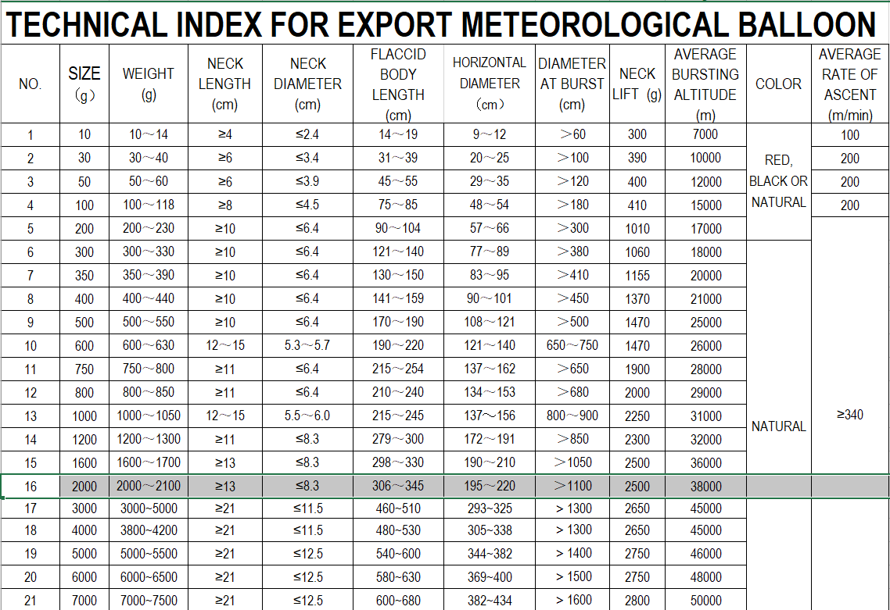

Да, по ссылке шары >2000г отсутствуют. Так что мы заказали тот что на 2кг, а потом уже, пообщавшись с продавцом, выяснили что можно заказать шарик и покруче. Стоит их пробовать или нет - решайте сами. Сразу скажу, что шар на 2кг обошелся нам примерно в 25000 руб. К тому же, у меня большие сомнения насчет возможности подъема выше 38км без реактивной тяги - уж очень мало там воздуха. Так что, если хотите наверняка - берите максимум 2кг.

### Полезная нагрузка

Тут без изменений. Ничего не убавили, ничего не добавили. Даже павербанки летали те же, что и в прошлый раз. Пролистываем.

## Программирование

А вот тут с изменениями :-)

Но с одной оговоркой: на Vostok-4 летала та же верси ПО, что и на Vostok-3b. Все изменения, описанные тут, сделаны по результатам анализа телеметрии Vostok-4 и эта версия еще никуда не летала! По этой же причине бранч не влит в мастер.

Вот предмет обсуждения: [bugfix/report_gaps](https://github.com/ArtemKiyashko/RpiProbeLogger/tree/bugfix/report_gaps)

А произошло следующее. В основном цикле есть такое условие:

```csharp
while (true)
{
    ...

    if (gpsData is not null || _reportService.ReportFileCreated)
    {
        //collect sensor data nad write report entity
    }
    Thread.Sleep(1000);
}
```

Я объяснял в первой части, что точка синхронизации всех параметров телеметрии - время, полученное по GPS. Соответственно, не имея данных GPS - нет смысл записывать отчет. Или есть? На самом деле есть, т.к. во-первых: нам не так уж и важно абсолютное время - достаточно относительного (просто записывать каждую секунду). Во-вторых: гораздо более удачной точкой синхронизации может стать высота, а не время. А высота у нас не только от GPS, но ее можно вычислить и по барометрической формуле (и мы это делали в первой статье). Но этот метод требует определенного оборудования за бортом. Например градусника, способного измерить очень низкие температуры (ниже -40C). Наш внешний градусник ограничен нижней планкой в -40C, а внутренний - подвержен влиянию нашей системы климатизации (нагревается от RPI и охлаждается забортным воздухом).

В общем, данные GPS не сильно важны (но очень желательны), оттого появилось это `|| _reportService.ReportFileCreated`. Так уж получилось, что хоть 1 раз, но GPS нам необходим - чтобы сгенерировать имя файла отчета ¯\\_(ツ)_/¯ А дальше уже можно и без GPS, и все должно быть хорошо.

Но, листая телеметрию с этого запуска, я обнаружил следующее:


Видите, видите? "Расстояние" между 2-я этими соседними строчками немного больше чем 1 секунда. Оно почти **полчаса!** Откуда? Что? Как? Да, очевидно что мы потеряли GPS на какое-то время, но ведь, следуя условию в основном цикле, мы все равно должны были записать данные с сенсоров.

<cut>
Одной из возможных причин потери сигнала GPS могло быть вот это:

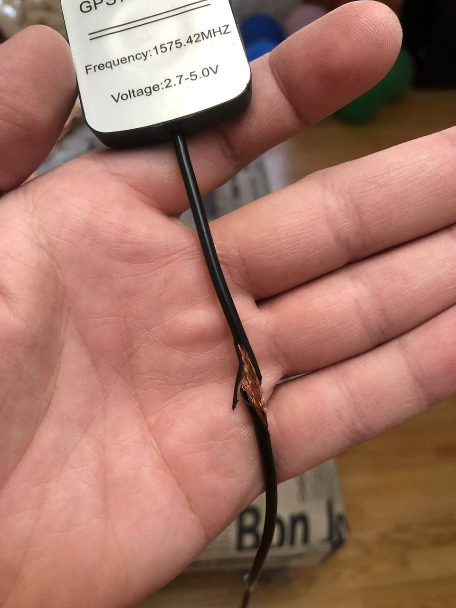

Мы не знаем, в какой момент это произошло, но есть не нулевая вероятность что изоляция перетерлась на подъеме (когда шар больше всего крутило) и это послужило "началом конца". Эта антенна была закреплена на центральном парашютном фале и вполне могла там и запутаться. Это конечно лишь мои догадки, но все же.
</cut>

Причина оказалась совсем детской - `NullReferenceException` вот тут:


Мда... Собственно, это и есть весь фикс. Но этот случай вынудил меня написать юнит-тесты для всего этого хозяйства, чему и посвящено 99% изменений в бранче с фиксом. Сейчас там конечно не *full coverage*, но основные моменты я покрыл.

> Раньше я быстро писал некрасивый и нерабочий код, но спустя многие годы упорной работы я перестал писать его быстро

Единственной проблемой было то, что все классы библиотеки для работы с SenseHAT ([SenseHatNet](https://github.com/johannesegger/SenseHatNet)) - не абстрактные, не реализуют интерфейс, да еще и запечатанные. Такая диспозиция вынуждает меня создавать пограничные интерфейсы, а я такое не очень люблю, но сделать их пришлось. Других проблем не было.

Сами тесты (если интересно) посмотрите в [репозитории](https://github.com/ArtemKiyashko/RpiProbeLogger/tree/bugfix/report_gaps), а тут мы посмотрим на результаты.

До фикса:


После фикса:


Ну и запуск теста с записью в файл:


Видим, что данных GPS нет, но остальные данные на месте. Выпили ромашковый чай и двинули дальше.

## Бухгалтерия

Тут почти все идеально, наконец-то :-)


Траты были только на *расходники*: шар и гелий. Ну и на новые парашюты. Теоретически, их тоже можно вписать в расходники, но чуть более *long-term*. С другой стороны - так можно все что угодно вписать в расходники. Ведь ни что не вечно. Тем не менее, мы не рассматривали конструкцию как "полностью переиспользуемую" на протяжении долго времени. А для нескольких запусков одного нормального парашюта вам должно хватить. Едиственное, что вы 100% будете докупать - это шар и гелий.

## Подготовка к запуску

Этот пункт был подробно рассмотрен в первой части статьи, с тех пор механика поиска места запуска не изменилась.

Но! Тут хочу отметить один важный момент: меня много раз в комментариях дергали вопросом обеспечения безопасности полетов и, в целом, "легализации" этого занятия. Как то: получение разрешения на использование воздушного пространства и подача плана полета в организацию воздушного движения. В прошлый раз я ответил в коментариях, почему не могу сейчас описать этот процесс в статье. Эта же причина сохранилась и по сей день, но мы над этим работаем и все выглядит так, будто бы дело сдвинулось с мертвой точки. Да, планы мы всегда (!) подавали, но процесс их подачи на данный момент непригоден для описания в виде "инструкции". А так как это очень важная часть всей нашей затеи - мы решили довести этот вопрос до пригодного состояния и выложить это как небольшую, но отдельную часть серии статей про самодельный стратостат. Как минимум это сильно облегчит поиск этой информации для тех, кто решит повторить этот путь. Так что ждите, будет отдельно и по делу про "ОрВД, ЕЦ, СЦ и ФГУП" и прочие генераторы случайных букв в российских госструктурах.


## Запуск

Помните, в прошлый раз на поиск наш гитарист притащил лодку? В этот раз на запуск он притащил тент 6x4 метра. Несмотря на то, что запуск Vostok-3a провалился по причине наших кривых рук, он решил что проблема не в нас, а в тенте. И сшил на заказ новый, белый и красивый. Смысл использования тента при запуске был тем же, что и всегда - уменьшить нагрузку на горловину шара, пока его надувают гелием. Ведь шар надо удерживать за "что-то", чтобы он не улетел раньше времени (как случилось с Vostok-2). Ну вот...


¯\\_(ツ)_/¯

Честно говоря, этот вариант использования тента мне даже больше понравился и он не лишен смысла. Сейчас объясню разницу с запуском Vostok-2.

После провала с Vostok-2, нашим скорополительным решением стал злополучный тент. Надо было его лишь правильно растянуть над местом запуска и надувать шар под ним. Тогда это практически ликвидировало бы нагрузку на горловину. Но! Как вы можете помнить, Vostok-2 то мы перекачали. Это "раз". "Два": масса шара Vostok-2 - **800 граммов**. Масса шара Vostok-4 - **2000 граммов**. В 2,5 раза тяжелее. За счет чего, даже при том же количестве гелия внутри - он и сам себя будет неплохо прижимать к земле. Так что, если закачать правильно количество гелия и иметь достаточно тяжелый шар - надобность в тенте над ним пропадает. Вот мы и решили использовать тент "под ним".

>Рекомендуемое количество гелия зависит от начального диаметра шара. И, в случае с шарами L-800 и L-2000, это 1 баллон 40л с давлением 150 атм.

Расстелить тент на земле - не бесполезное занятие. Вершки-корешки, палки-копалки, да мало ли мусора в лесу валяется? Любая мусоринка может повлиять на целостность шара еще до запуска! Так что, как подстраховку, рекомендую расстелить хотя бы полиэтилен и надувать уже на нем.

И так, мы расположились, разделились, каждый по своим делам. Первым делом запитали наш *афроящик*:


Ждем пока красный свет не сменится на зеленый. А если не сменится - значит дело плохо и надо разбираться прям там в лесу. Но, спустя несколько секунд видим что все ок:


А еще видим, что на нем нет крышки. Это не потому, что мы ее еще не поставили. Это потому, что мы ее **забыли сделать**. По пути мы заскочили в строительный магазин и купили лист самого обычного пенопласта. Его недостатки я описывал уже: он слишком толстый и хрупкий для наших нужд. Но, когда у вас стоит выбор между "ничего" и "плохой пенопласт" - выбирайте пенопласт. Там же нарезали себе крышку, проделали в ней отверстие для крепления парашютов и заклеили короб. Из-за спешки (и пенопласта) отверстие для крепления получилось слишком большим и через него в полете поступал забортный воздух. Что *не очень хорошо* сказалось на климате внутри коробки и это будет видно при разборе телеметрии. А вы помните, что основная проблема, возникающая из-за низких температур - быстрая разрядка элементов питания. А питание - это всё. Это и камера, и телеметрический модуль, и поисковый трекер. Да, каждый узел имеет независимое питание, но все они расположены внутри коробки. Так что батарейки надо беречь и греть. В данном случае, наши аккумуляторы выдержали. Но лучше так не рисковать.

Больше приключений не было. Мы спокойно закачали ровно 1 баллон на 40л, слегка придерживая шар рукой за горловину. Благодаря свой массе (шара), это было не сложно.


Прицепили парашютный фал к шару, фал полезной нагрузки к парашютам и просто разжали руки, отпустив шарик в ночное небо. И стали мониторить, пока была такая возможность (напоминаю: поисковый трекер фиксирует высоту только до 10км):


Я же говорил в прошлый раз, что мы больше никогда не будем пытаться искать трекер в день запуска? Честно говоря, сейчас таких планов тоже не было. Это бессмысленно. Улететь он может на сотни километров (и улетел), да, к тому же, на дворе ночь! Но мы решили все же подождать - вдруг он упадет рядом с дорогой, в легкой доступности? Мы развели костерок, сообразили поесть и принялись ждать. План был такой: ждем до полуночи, если нет новостей - едем по домам, если есть новости - смотрим где упал и решаем. До полуночи с момента запуска оставалось 4 часа, а мы уже знаем, что примерно столько наши шары и летают. Так что шансы узнать место приземления в этот же день были вполне реальны.

Тем временем зонд начал рапортировать о наборе высоты:


И набирал он ее довольно бодро: чуть больше чем за час - 7553 метра. Неплохо для двухкилограммового шара. Дальше, очевидно, он преодолел рубеж в 10км и пропал *с радаров*. Мы доели шашлык, дождались полуночи и, не получив сигнала от трекера, двинулись домой. Нас ждали 400км пути и поиск этого несчастного в другой день. Опять не повезло.

## Поиск и спасение

И, практически ровно в полночь, он проснулся. Но...


Во-первых - снова болото. Во-вторых - что-то тут не так с показаниями. Высота 128 метров? Нуууу, впринципе, это возможно. Скорость не нулевая? Это очень странно. Он либо лежит (и 128 метров это высота поверхности в данной местности над уровнем моря), либо продолжает лететь на такой высоте. Но больше всего меня насторожило вот это: **Low Battery**!

Если он не лежит на поверхности (скорость не нулевая же) и вот-вот разрядится - будет чрезвычайно сложно его найти. Честно говоря, к такому никто готов не был. Поисковый трекер у нас считался самым надежным элементом системы и от него зависел успех миссии.

Прямо посреди шоссе мы стояли и ждали, в надежде, что трекер пришлет еще одно сообщение. Он настроен присылать треки раз в 5 минут при наличии движения и раз в сутки "статус-сообщение". Да, сигнал GPS не всегда стабильный, и иногда пропадает, это нормально. Но мы прождали не меньше получаса, а нового трека не было. Все портило **Low Battery** - если бы не оно, я был бы абсолютно спокоен. С полностью заряженными аккумуляторами этот трекер может проработать месяцы. А за это время сигнал нет-нет, да появится. Но он все не появлялся... Что ж, в этот день мы уже точно ничего не могли сделать и двинули дальше в сторону дома с еще худшим настроением чем было.

Практически 2-е суток он молчал. Двое суток мы в 8 рук тиранили приложение трекера своими запросами. К концу второго дня, принимая во внимание разряжающуюся батарею, надежды уже практически ни у кого не было. Но вдруг, мне в спам посыпалось:


И это означало лишь одно - придется нам снова ехать во всякие

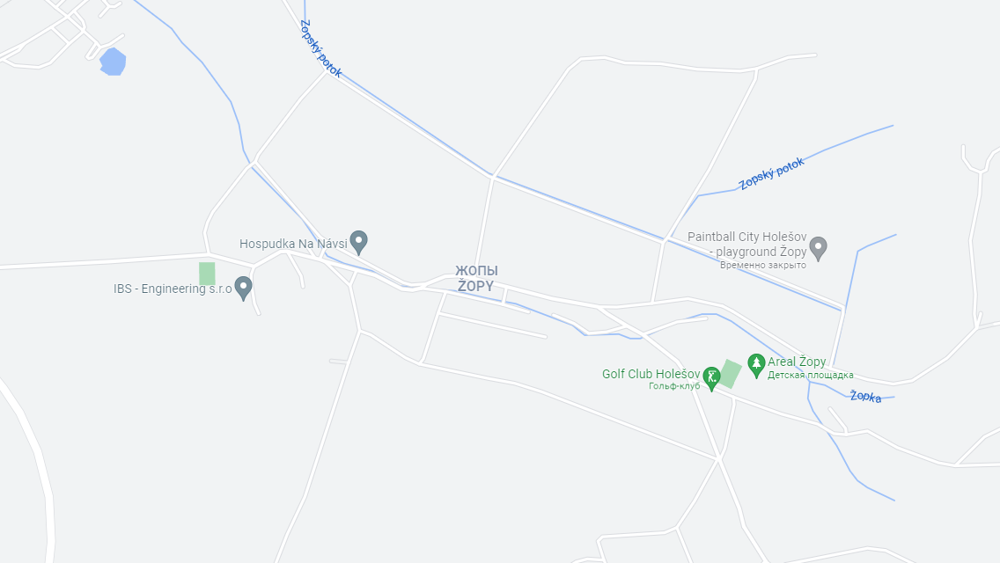

Ну ладно, не так далеко, конечно.

Было бы смешно, если бы он упал не в болото. Но он, по привычке, упал в болото:


А я ни разу не удивлен... Новгородская область богата на болота. Раньше надо было думать, когда выбирали место запуска. Хорошо хоть рек рядом не оказалось.

К сожалению, в этот момент я уже сидел в аэропорту и смотрел на самолеты. Так что искать и доставать наш "Vostok-4" ребятам предстояло без меня. Когда я слушал эту историю по телефону - это звучало как-то так:

> Аааа, медведи! Выстрелы! 700 верст по голову в болоте!!1 Взяли шашлык, но пришлось есть грибы! В той деревне все УМЕРЛИ!

Но сейчас, когда прошли недели, можно отбросить эмоции и взглянуть на ситуацию спокойно. Расстояние от точки высадки до зонда по прямой ~5км. Но по проямой там леса\болота. Давайте посмотрим, как шли участники нашей викторины:


**A**: точка высадки. Дорога, по карте, идет до дерени "Степаново" (точка **C**). На самом деле - нет. Ну, формально может дорога там и идет, но проехать по ней нельзя. Так что спешились и двинули на своих двоих

**B**: Свернули раньше времени, ушли немного в лес. Пришлось возвращаться назад. Тем более, что тут был обнаружен след медведя на земле (см. фото-пруф ниже)

**C**: Дошли до *крайней* деревни - Степаново. Это туда шла "дорога"

**D**: От "Степаново" пошли на север - тут начиналось первое болото. Да, болот там много и, так или иначе, но *парочку* пришлось бы пересечь

**E**: Пересекли первое болото. Не без потерь - потеряли носок (провалился гитарист под воду немного) :-)

**F**: Напрямую на северо-восток было не пройти - мешал лес. Откатились немного вдоль лесополосы на юго-запад. Тут начиналось второе болото

**G**: Пересекли и его. Зонд лежал по ожидаемым координатам - финиш


Весь маршрут - 8.14км в одну сторону. Еще столько же - обратно. Много это или нет (в условиях пересеченной местности и с нагрузкой из сухпайков) - решайте каждый для себя.

Как я уже упоминал - я (**не участник** этих событий) описываю это спустя недели. Так что довольно сухо и "по фактам". На самом же деле, они смогли мне выдать более-менее связный рассказ только **через 2 дня** после завершения этой вылазки - настолько сильно они вымотались. Да, и с точки **G** они мне отзвонились, и из машины по пути домой тоже. Но это больше походило на быссмысленное мычание в трубку, чтобы доложить, что они еще дышат. Тогда я думал, что они на меня обозлились, мол - отправил к черту на рога, а сам сидит там на диване и ест круасан. Но, так часто бывает при физическом и моральном истощении - просто не до разговоров. Точно так же было и при поиске Vostok-3b. Так что я старался терпеливо ждать, пока они отдышатся.

Тем не менее, вылазка всем понравилась. Места там очень красивые. Грибов вагон (никаких грибовизоров не надо), очень аутентичная заброшенная церковь, заброшенные деревни, даже медведи там водятся!

Несколько фоток оттуда:

<cut>


След медведя


Вход на болото


Заброшенная церковь


Заброшенная деревня
</cut>

> Изначально я попросил написать этот раздел непосредственного участника поиска (гитариста). Но это вышел слишком обширный рассказ, похожий на мой диплом, так что появилось 2 версии этого раздела: эта и версия гитариста. Так как я пишу статью на гитхабе (перед тем как постить куда-то), то заинтересовавшиеся смогут раскопать в репозитории статьи версию с рассказом гитариста. Пусть это будет мини-квест для любопытных IT-шников ;-)

## Результаты

Ну наконец-то. Давайте посмотрим, что же нам притащили эти ребята, ценой таких неимоверных усилий. Для начала еще раз взглянем на фото из заголовка. Вот оно:


Первое, за что цепляется глаз - две шкалы высот. Да, я решил вставить 2, потому что они расходятся. Не трудно догадаться, что "GoPro Alt" - это показания GoPro, а "RPI Alt" - показания нашего самописца полученные от GPS HAT.

Максимальное значение на шкале GP - **12109м**, на RPI - **35794м**. Это **очень** большая разница. Что-то тут не так! Что именно не так - я не смог узнать (хотел написать в саппорт GP, но не успел). Если у кого-то есть догадки - пишите в комментариях. У меня есть только теория. Которая основывается на подсказанной в комментария к первой статье ссылке - [COCOM Limits](https://en.wikipedia.org/wiki/Coordinating_Committee_for_Multilateral_Export_Controls). Суть ее сводится к следующему: у GPS приемников есть некоторые *искусственные* ограничения на фиксируемую высоту и скорость. В данном случае, опираясь на статью из вики, это **18000м** по высоте.

Тут есть два "НО". Во-первых: у нас 12км а не 18. Во-вторых: организация, занимающаяся контролем этих ограничений, вроде как упразднена. Я закину еще одно предположение: возможно эта функция была делегирована другой организации, а лимиты были изменены (в меньшую сторону).

Вы все еще можете думать: ой, да это не GP наврала и лимитов никаких нет. Это твой китайский GPS HAT врет. Но у меня есть еще аргумент в пользу верности показаний RPI - давление!

Существует несколько способов вычислить относительную высоту. Я использовал [барометрическую формулу](https://ru.wikipedia.org/wiki/%D0%91%D0%B0%D1%80%D0%BE%D0%BC%D0%B5%D1%82%D1%80%D0%B8%D1%87%D0%B5%D1%81%D0%BA%D0%B0%D1%8F_%D1%84%D0%BE%D1%80%D0%BC%D1%83%D0%BB%D0%B0). Суть ее в том, что с набором высоты плотность воздуха и, соответственно, давление падает. А, зная давление "на поверхности", мы можем, зная давление "на высоте", вычислить саму высоту. Проблема тут только одна - нужно знать температуру окружающей среды. В чем проблема, спросите вы? А вы помните, что наш градусник не фиксирует температуру ниже -40С? Вот в этом и проблема. Как вариант, я попробовал использовать показания внутреннего термометра (который в Sense HAT). Я упоминал, что мы проделали слишком большое отверстие в крышке полезной нагрузки и через нее поступал забортный воздух. Вот я и подумал, что, возможно, там была более "реальная" температура. На самом деле нет. Все эти цифры абсолютно не годились для расчета высоты. И я покажу это на графике:

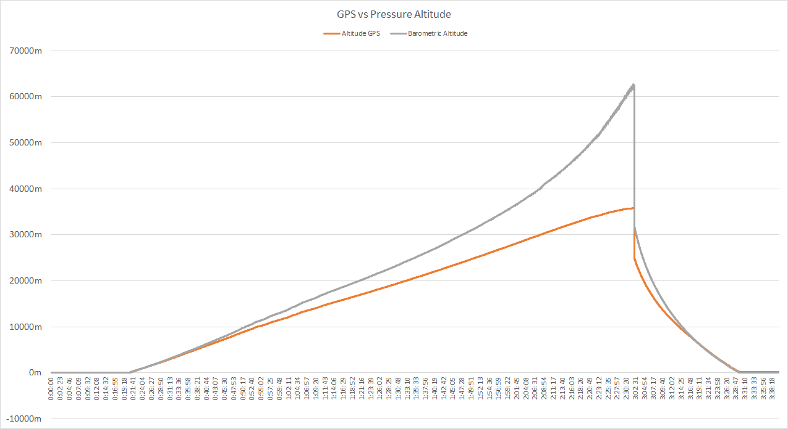

Видите? Пока была высота, где термометр давал +/- реальные данные - графики не сильно расходились. Но, со временем, разница выросла в критическую.

Ну а где же пруф с высотой по давлению? В самом давлении! Давайте вспомним, какие показания давления у нас были ранее и сравним с давлением сейчас:

| Шар | Высота (м) | Давление (мбар) |
|-----|-------------------|-----------------|
| Vostok-1 | 18993 | 58 |
| Vostok-3b | 25573 | 19.8 |
| Vostok-4 | 35794 | 0.49 |

Как видите - давление в последнем запуск зафиксированно намного меньшее, чем в предпоследнем. Да, зависимость не линейная, это видно даже без графика, но зависимость есть и она точно не в пользу показаний с GoPro. Вот, посмотрите на график:

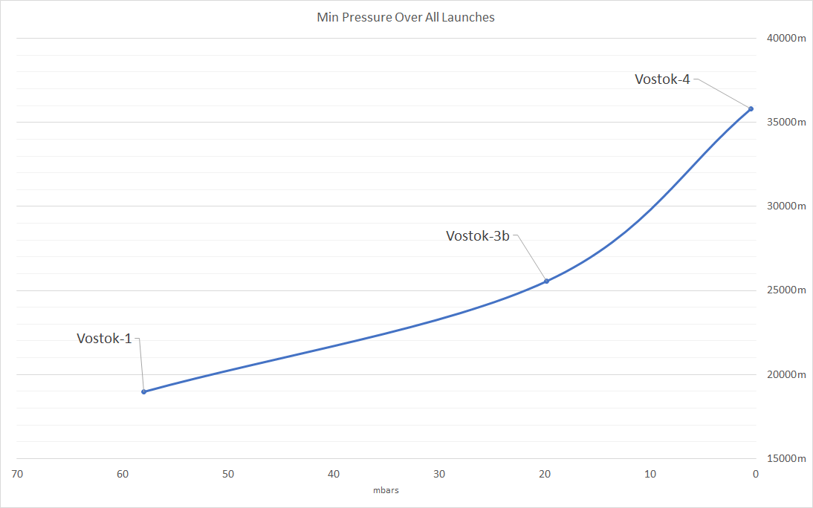

Итак, вы можете поверить, что при давлении 0.49 миллибар там было всего 12км, как говорит GoPro? Убедительно? Убедительно. С этих самых пор, мы стали считать, что нами достигнута высота **35794м**

"Т.е. ваш шар поднялся до высоты 35794м?". На самом деле - нет :-) Шар, *скорее всего* поднялся даже выше!

Давайте вспомним тот баг с пропажей GPS сигнала и NRE в коде. Добавим к этому видео с камеры (не обращая внимания на ее телеметрию). И посмотрим график высоты по показаниям RPI:

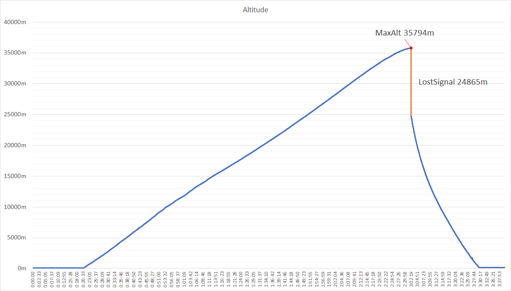

Оранжевый сегмент - это отсутсвие данных. Но, так как строчки в логе идут одна за одной (баг же), то нет разрыва по времени. Разрыв я вам показывал - почти полчаса. Итак...

После 35794 у нас есть *период неизвестности*. Что делал шар в эти полчаса - в логи (в явном виде) не попало. Но мы можем пытаться экстраполировать имеющиееся данные! Я сделаю это очень грубо, т.к. не вижу смысла в очень точных рассчетах в данном случае.

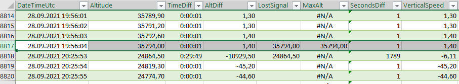

Расчитаем и возьмем вертикальную скорость шара перед пропажей сигнала: **1.4м/с**.

Расчитаем и возьмем вертикальную скорость шара после появления сигнала: **-45.2м/с** (я не беру в расчет значение 6.11м/с, так как это значение, посчитанное для промежутка потери сигнала).

**Допустим**, что эти скорости корректны и для отсутсвующего отрезка. Теперь главный вопрос: до какой высоты **X** успеет подняться шар, чтобы через полчаса (учитывая и время подъема с заданной скоростью - 1.4м/с) его высота была равна 24864м?

Честно вам скажу - я заленился это считать, так что я просто прикинул в голове, что это где-то 1.8-1.9км дополнительно. Итого, с оооочень большим допущением, мы получим максимальную высоту **~38км**. И, сюрприз-сюрприз, это как раз регламентированная максимальная высота для этого шара. Нет, конечно, с такими расчетами мы не можем себе приписать 38км, но мы можем похвалить производителя шаров: с высокой долей вероятности - он не соврал (а мы правильно накачали и запустили).

Раз уж затронули вертикальную скорость - давайте построим и ее график. В конце концов, она для нас тоже важна, особенно на этапе снижения, чтобы оценить эффективность парашютов. Сначала "общий план":

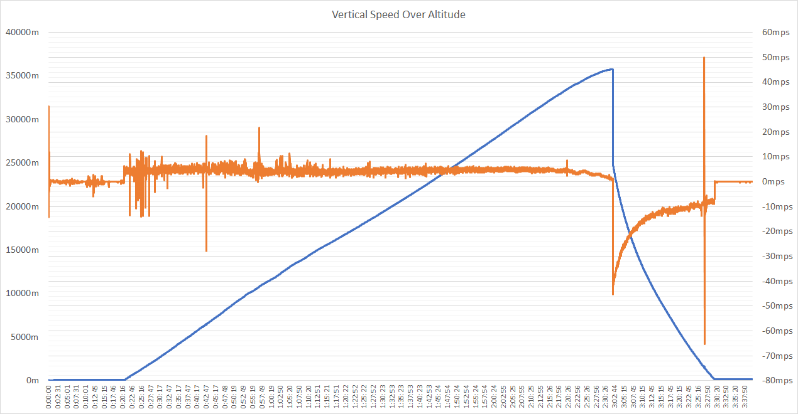

Что меня тут радует - это относительно "ровная" скорость на подъеме. Она держалась в пределах 3-7м/с, что нас более чем устраивает (в полетном плане мы указываем скорость подъема 5м/с). Не смотрите на эти пики - это кратковременное пропадание сигнала GPS так сказывается. Да, потеря его на 1-2 сек - это вполне нормальное явление.

Что меня *не радует* - очень медленное *гашение* скорости на спуске. Давайте посмотрим поближе:

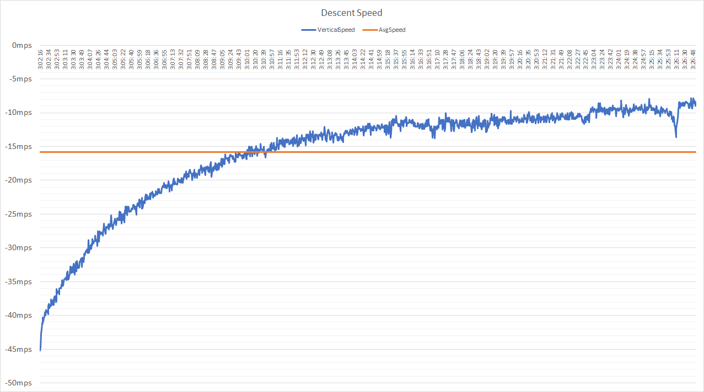

Мда... На этом графике хорошо видно, как наша нагрузка отчаянно боролась за жизнь. Нет, ну я конечно понимаю, что на 30+ км почти нет воздуха (давление 0.5мбар), но даже к моменту достижения 10км (лучше видно на общем графике) скорость была больше 10м/с. А там уже с атмосферой намного получше и самолеты летают. Но, надо отдать должное, почти у самой земли парашюты все же справились и "загасили" скорость до приемлемых **7-8м/с**. Пусть это будет напоминанием тем, кто считает, что 2 парашюта всегда лучше чем один.

На этом аномалии не заканчиваются. Следующая головная боль - внутренняя температура.

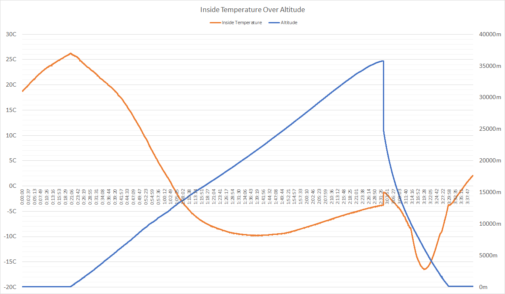

Замерз наш RPI, не побоюсь этого слова - втруху! Если кто не помнит, обычно он у нас в полете функционирует при температуре +30С и выше. А тут он замерзал до -16С! Это нам (и всем тем, кто решит сделать свой стратостат) хороший урок - уделяйте особое внимание планированию воздушных потоков в коробе. Отверстия должны быть сбоку, но никак не сверху. Схема правильной климатизации в первой части статьи. А тут, напомню, мы второпях просто поставили дырявую крышку. Вот, что из этого получилось. Да, хоть RPI и работал при -16С, но элементы питания выдержали весь полет. Могу сказать, что нам просто повезло. Вы так не делайте ;-)

Я так же пытался найти закономерность между внутренней температурой и вертикальной скоростью (раз уж она посчитана):

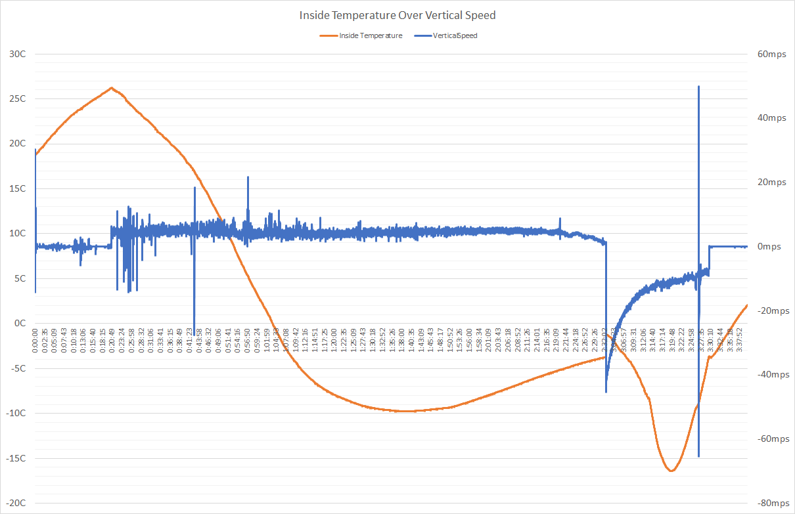

Кто-то видит закономерность? Я - не особо. Меня интересует зависимость температуры от скорости подъема. Но график скорости +/- ровный, в то время как температура "скачет". Ну что же, видимо это связано не с вертикальной скоростью. На спуске (там где скорость уходит резко вниз) мы, ожидаемо, видим падение температуры и потом быстрый нагрев. И такое поведения вполне естественно. Так что извините, но я все еще не вижу вины скорости в переохлаждении нашей коробки.

Ладно, это была "так себе аномалия". Понятно, что в дырявом коробе будет "дуть". Но сейчас вы увидите кое что покруче:

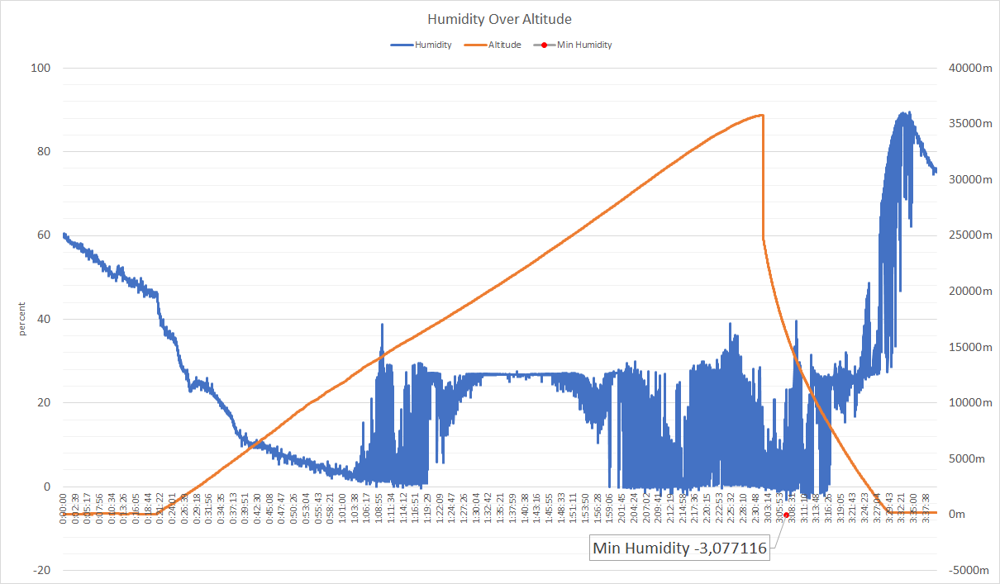

Влажность. Да-да, **отрицательная влажность**. -3?! Если у кого-то есть рабочий аргумент: что это и как получилось - я бы очень хотел его услышать.

По поводу "закрашенных" областей у меня такое предположение - мы где-то нацепляли воды "по дороге". Может в облаках. И эта *капелька росы*, как-то всю дорогу портила нам показания (ранее на таких высотах этот сенсор вел себя корректно). Возможно с этим связаны и отрицательные значения. *Возможно*.

Ну что же. Это была сама сложная часть анализа телеметрии. Перейдем к "дежурным" и очевидным данным.

Давление:

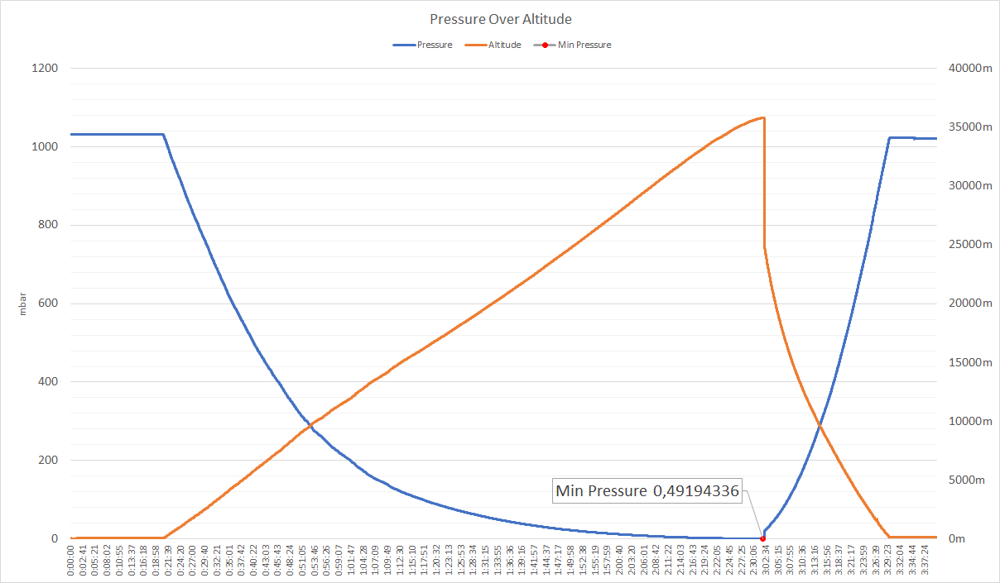

Очередной рекорд в наших запусках: 0.49мбар! Похлопаем ему и идем дальше.

Температура за бортом:

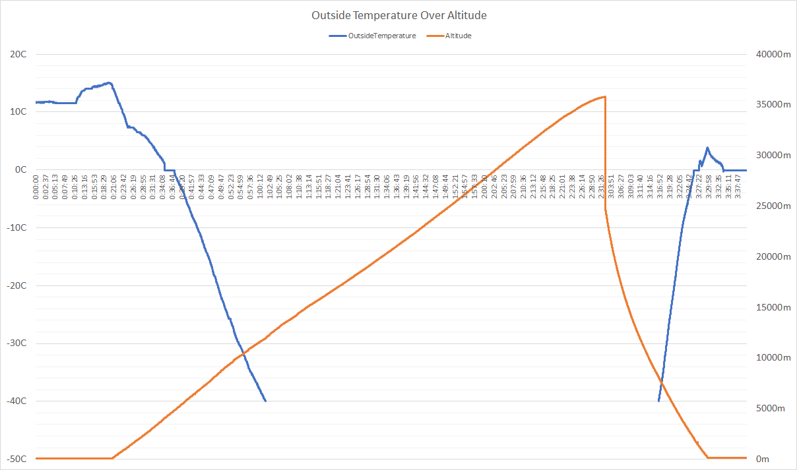

Тоже без сюрпризов, но и без рекордов. Да, внешний градусник надо менять в первую очередь. Но с этим есть некоторые технические сложности, с которыми мы пока разбираемся. Надеюсь на следующий запуск полетит нормальный градусник.

На этом все. Я, как обычно, оставляю ссылки на всю телеметрию, для желающих покопаться самостоятельно:

[Оригинал](telemetry/28092021.csv)

[Мои изыскания](telemetry/28092021.xlsx)
## Видео

Не самое лучшее наше видео, но, технически - это видео. Видео с высоты 30+ км в 4k, как мы и обещали. Да, 99% тут просто телеметрия поверх черного фона. Но, все же, есть пара интересных моментов:

- Маскимальная высота, зафиксированная RPI (дальше мы потеряли сигнал GPS, но видно, что зонд еще не падает): 2:07:10
- Момент взрыва шара: 2:38:13

[](https://youtu.be/ytTm10yJM-0 "Vostok-4. Full Flight")

Я мог немного напортачить с синхронизацией телеметрии (GoPro vs RPI) и из-за бага в самописце - это сложно установить. Фактически, я могу синхронизировать только по старту: в момент разрыва шара GPS от RPI еще не появился, а до момента приземления не дожила камера. То, что происходит с показаниями RPI после потери сигнала - особенности поведения софта наложения телеметрии. Он, почему-то, решает *сгладить* резкие перепады и снижает плавно все показатели до 0, хотя их там нет совсем. Это поведение мне победить не удалось.

## Выводы

По ходу прочтения статьи, вы уже могли сделать все правильные выводы. Давайте подведем итог:

- Не используйте стропные парашюты
- Используйте только 1 парашют. Диаметр купола зависит от массы спускаемой нагрузки. Для нагрузки до 1.5кг рекомендуется диаметр купола 1.2-1.4м. Можно больше (если найдете). Это по желанию.
- Пишите юнит-тесты к своему ПО
- Уделяйте внимания отверстиям на коробе. Не должно быть ничего, кроме предусмотренных климатизацией. Рекомендую использовать схему охлаждения из первой статьи
- Не запускайте в темное время суток

Вот, пожалуй, и все.

Из планов на будещее обозначу следущие:

1. Мы хотим сделать еще как минимум 1 запуск и привезти *нормальное* видео. Запуск этот будет не раньше апреля 2022
2. Будут *некоторые* изменения в полезной нагрузке. Надеюсь за каникулы я успею сделать задуманное. Но, по прежнему, не ожидайте запуска спектроанализатора :-)

   Как минимум, мы повозимся вот с этим (спасибо @akaAzazello за наводку):

   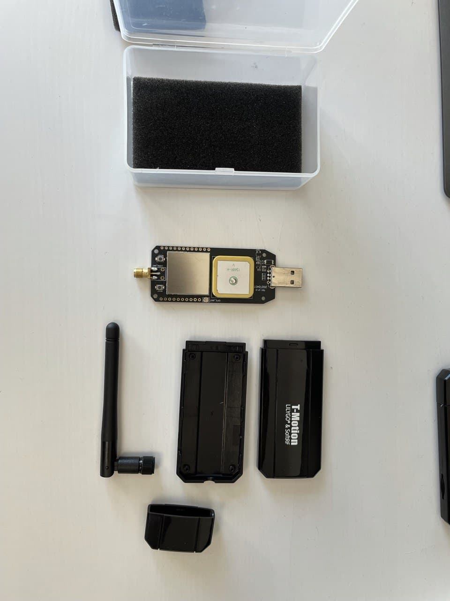

   Также, попробуем добавить камер (скорее всего HQ RPI Camera или аналоги)
3. Ожидайте скорый выход статьи по легализации этих запусков. Мы прошли этот долгий путь, чтобы сделать его коротким для вас

Вот теперь точно все. Fly safe, cmdr!
