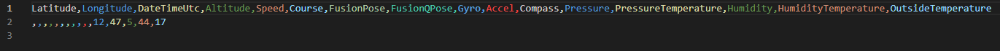

# Самодельный стратостат. Часть 3


Те из вас, кто читал предыдущие части моей истории, сейчас наверняка пристально разглядывают эту картинку и у них в голове появляются вопросы. Если вы присоединились только к 3-й части - все равно запрыгивайте, будет интересно и будут ссылки на прошлые части. Как можно догадаться - мы снова это сделали. Мы запустили свой самодельный стратостат из жвачки и картофельных батареек, и привезли немного интересного из стратосферы. Хотите узнать почему это фото именно такое? Поехали!

## Вступление

[Самодельный стратостат. Часть 1](https://habr.com/ru/post/555070/)

[Самодельный стратостат. Часть 2](https://habr.com/ru/post/577184/)

Да потому что мы сделали запуск ночью... Мы, конечно, не планировали запуск ночью, но "человек предполагает, а COVID располагает"... Так что расписание наше пришлось подвинуть, пока все не перестали кашлять и запуск сдвинулся на будний день. А там у всех дневная работа, заботы и т.п. Перенести на ближайшие выходные не получилось уже из-за меня - мне надо было срочно улетать домой. В общем это был вечер буднего дня.

> По секрету скажу (я эту мысль никому из команды ранее не озвучивал, иначе меня засмеяли бы), что у меня была идея запустить ночью, *когда-нибудь*. Я, почему-то, думал, что GoPro вытащит неплохой ночной вид на видео. Но, как вы понимаете, не вытащила, хоть и снимала с максимальным для нее ISO 1600. Хотя фото это мне нравится - на нем Луна :-)

Все! На этом можно заканчивать. Ну ладно, ладно. Я расскажу как все было и почему все было именно так.

Для начала небольшое отступление для вновь подключившихся. Около года назад мы с друзьями решили собрать свое *нечто*, способное подняться на высоту 30+ км, записать там видео и некоторые данные, вроде влажности, температур, давления и т.п. Мы назвали это *самодельный стратостат*. В первой части статьи приведен подробный план постройки этого аппарата (все этапы). Во второй части мы учли некоторые ошибки прошлого и повторили запуск(-и). 3апускали мы 3 раза, всего было 4 шара, улетело из них на тот момент - 2. И вот, наш 4-й запуск, в который полетел, улетел и прилетел наш 5-й шар - **Vostok-4** (да-да, naming convention описан во второй части статьи).

Вцелом, всю нашу историю за прошедший год можно изобразить вот этой совершенной инфографикой:


Да, вы снова видите эту цифру: **35794м**. И на фотке из заголовка она, и тут она. Все верно. Но обо всем по порядку.

## Конструкция

### Общая конструкция

Хоть я и обещал в прошлый раз, что технических изменений не будет, но, как говорится - еще ни один план не пережил начало битвы. А битва у нас случилась с парашютом. Дело в том, что за все наши запуски наш самый первый парашют поистрепался. Я упоминал уже, что, даже после первого запуска, он немного надорвался на внутренней поверхности купола. Повреждение было не критичным и мы запустились с ним еще раз. Это его и добило. Нет, посадка Vostok-3b была мягкой, но парашют окончательно пришел в негодность и мы решили его заменить.

*Почему-то* наш конструктор посчитал хорошей идеей вместо одного парашюта сделать два. Ну, на самом деле, аргумент его был весьма прост: больше парашютов - мягче посадка (суммарная площадь поверхности, создающей сопротивление, ведь больше). Помогло это или почему не помогло обсудим в результатах. А сейчас очень важный нюанс: первый парашют был бесстропный, вторые два со стропами. И я вам наперед скажу: если не хотите проблем - со всей силы ищите бесстропные парашюты.

Итак, у нас 2 стропных парашюта, каждый из которых крепится своим фалом к горловине шара. Снизу, от строп парашютов идут независимые фалы к еще одному фалу, который уже крепится к полезной нагрузке. Схематично это выглядит так (масштаб не учтен):


> Существует древняя истина: чем больше в системе элементов - тем чаще она ломается. Это правда, я про это знал и... ничего конструктору не сказал. Представленная схема креплений Vostok-4 сильно сложнее прошлых версий. Тут и фалов вагон, и парашютные стропы, и их соединения. В общем - так себе идея. Но проверить стоило.

Следующим изменением был сам шар - основа всей конструкции. Как вы могли заметить на инфографике, каждый раз мы запускали разные шары. На этот раз мы раздобыли у китайских коллег царь-шар массой **2 килограмма**. Это в 6 раз больше чем было у Vostok-3b. Ну и он не подвел.

Ссылка на шар: [aliexpress](https://aliexpress.ru/item/1822808425.html)

Заявленные характеристики следующие:


Да, по ссылке шары >2000г отсутствуют. Так что мы заказали тот что на 2кг, а потом уже, пообщавшись с продавцом, выяснили что можно заказать шарик и покруче. Стоит их пробовать или нет - решайте сами. Сразу скажу, что шар на 2кг обошелся нам примерно в 25000 руб. К тому же, у меня большие сомнения насчет возможности подъема выше 38км без реактивной тяги - уж очень мало там воздуха. Так что, если хотите наверняка - берите максимум 2кг.

### Полезная нагрузка

Тут без изменений. Ничего не убавили, ничего не добавили. Даже павербанки летали те же, что и в прошлый раз. Пролистываем.

## Программирование

А вот тут с изменениями :-)

Но с одной оговоркой: на Vostok-4 летала та же верси ПО, что и на Vostok-3b. Все изменения, описанные тут, сделаны по результатам анализа телеметрии Vostok-4 и эта версия еще никуда не летала! По этой же причине бранч не влит в мастер.

Вот предмет обсуждения: [bugfix/report_gaps](https://github.com/ArtemKiyashko/RpiProbeLogger/tree/bugfix/report_gaps)

А произошло следующее. В основном цикле есть такое условие:

```csharp
while (true)
{
    ...

    if (gpsData is not null || _reportService.ReportFileCreated)
    {
        //collect sensor data nad write report entity
    }
    Thread.Sleep(1000);
}
```

Я объяснял в первой части, что точка синхронизации всех параметров телеметрии - время, полученное по GPS. Соответственно, не имея данных GPS - нет смысл записывать отчет. Или есть? На самом деле есть, т.к. во-первых: нам не так уж и важно абсолютное время - достаточно относительного (просто записывать каждую секунду). Во-вторых: гораздо более удачной точкой синхронизации может стать высота, а не время. А высота у нас не только от GPS, но ее можно вычислить и по барометрической формуле (и мы это делали в первой статье). Но этот метод требует определенного оборудования за бортом. Например градусника, способного измерить очень низкие температуры (ниже -40C). Наш внешний градусник ограничен нижней планкой в -40C, а внутренний - подвержен влиянию нашей системы климатизации (нагревается от RPI и охлаждается забортным воздухом).

В общем, данные GPS не сильно важны (но очень желательны), оттого появилось это `|| _reportService.ReportFileCreated`. Так уж получилось, что хоть 1 раз, но GPS нам необходим - чтобы сгенерировать имя файла отчета ¯\\_(ツ)_/¯ А дальше уже можно и без GPS, и все должно быть хорошо.

Но, листая телеметрию с этого запуска, я обнаружил следующее:


Видите, видите? "Расстояние" между 2-я этими соседними строчками немного больше чем 1 секунда. Оно почти **полчаса!** Откуда? Что? Как? Да, очевидно что мы потеряли GPS на какое-то время, но ведь, следуя условию в основном цикле, мы все равно должны были записать данные с сенсоров. Причина оказалась совсем детской - `NullReferenceException` вот тут:


Мда... Собственно, это и есть весь фикс. Но этот случай вынудил меня написать юнит-тесты для всего этого хозяйства, чему и посвящено 99% изменений в бранче с фиксом. Сейчас там конечно не *full coverage*, но основные моменты я покрыл.

Единственной проблемой было то, что все классы библиотеки для работы с SenseHAT ([SenseHatNet](https://github.com/johannesegger/SenseHatNet)) - не абстрактные, не реализуют интерфейс, да еще и запечатанные. Такая диспозиция вынуждает меня создавать пограничные интерфейсы, а я такое не очень люблю, но сделать их пришлось. Других проблем не было.

Сами тесты (если интересно) посмотрите в [репозитории](https://github.com/ArtemKiyashko/RpiProbeLogger/tree/bugfix/report_gaps), а тут мы посмотрим на результаты.

До фикса:


После фикса:


Ну и запуск теста с записью в файл:



Видим, что данных GPS нет, но остальные данные на месте. Выпили ромашковый чай и двинули дальше.

## Бухгалтерия

Тут почти все идеально, наконец-то :-)


Траты были только на *расходники*: шар и гелий. Ну и на новые парашюты. Теоретически, их тоже можно вписать в расходники, но чуть более *long-term*. С другой стороны - так можно все что угодно вписать в расходники. Ведь ни что не вечно. Тем не менее, мы не рассматривали конструкцию как "полностью переиспользуемую" на протяжении долго времени. А для нескольких запусков одного нормального парашюта вам должно хватить. Едиственное, что вы 100% будете докупать - это шар и гелий.

## Подготовка к запуску

Этот пункт был подробно рассмотрен в первой части статьи, с тех пор механика поиска места запуска не изменилась.

Но! Тут хочу отметить один важный момент: меня много раз в комментариях дергали вопросом обеспечения безопасности полетов и, в целом, "легализации" этого занятия. Как то: получение разрешения на использование воздушного пространства и подача плана полета в организацию воздушного движения. В прошлый раз я ответил в коментариях, почему не могу сейчас описать этот процесс в статье. Эта же причина сохранилась и по сей день, но мы над этим работаем и все выглядит так, будто бы дело сдвинулось с мертвой точки. Да, планы мы всегда (!) подавали, но процесс их подачи на данный момент непригоден для описания в виде "инструкции". А так как это очень важная часть всей нашей затеи - мы решили довести этот вопрос до пригодного состояния и выложить это как небольшую, но отдельную часть серии статей про самодельный стратостат. Как минимум это сильно облегчит поиск этой информации для тех, кто решит повторить этот путь. Так что ждите, будет отдельно и по делу про "ОрВД, ЕЦ, СЦ и ФГУП" и прочие генераторы случайных букв в российских госструктурах.


## Запуск

Помните, в прошлый раз на поиск наш гитарист притащил лодку? В этот раз на запуск он притащил тент 6x4 метра. Несмотря на то, что запуск Vostok-3a провалился по причине наших кривых рук, он решил что проблема не в нас, а в тенте. И сшил на заказ новый, белый и красивый. Смысл использования тента при запуске был тем же, что и всегда - уменьшить нагрузку на горловину шара, пока его надувают гелием. Ведь шар надо удерживать за "что-то", чтобы он не улетел раньше времени (как случилось с Vostok-2). Ну вот...


¯\\_(ツ)_/¯

Честно говоря, этот вариант использования тента мне даже больше понравился и он не лишен смысла. Сейчас объясню разницу с запуском Vostok-2.

После провала с Vostok-2, нашим скорополительным решением стал злополучный тент. Надо было его лишь правильно растянуть над местом запуска и надувать шар под ним. Тогда это практически ликвидировало бы нагрузку на горловину. Но! Как вы можете помнить, Vostok-2 то мы перекачали. Это "раз". "Два": масса шара Vostok-2 - **800 граммов**. Масса шара Vostok-4 - **2000 граммов**. В 2,5 раза тяжелее. За счет чего, даже при том же количестве гелия внутри - он и сам себя будет неплохо прижимать к земле. Так что, если закачать правильно количество гелия и иметь достаточно тяжелый шар - надобность в тенте над ним пропадает. Так что мы решили использовать тент "под ним".

>Рекомендуемое количество гелия зависит от начального диаметра шара. И, в случае с шарами L-800 и L-2000, это 1 баллон 40л с давлением 150 атм.

Расстелить тент на земле - не бесполезное занятие. Вершки-корешки, палки-копалки, да мало ли мусора в лесу валяется? Любая мусоринка может повлиять на целостность шара еще до запуска! Так что, как подстраховку, рекомендую расстелить хотя бы полиэтилен и надувать уже на нем.

И так, мы расположились, разделились, каждый по своим делам. Первым делом запитали наш *афроящик*:


Ждем пока красный свет не сменится на зеленый. А если не сменится - значит дело плохо и надо разбираться прям там в лесу. Но, спустя несколько секунд видим что все ок:


А еще видим, что на нем нет крышки. Это не потому, что мы ее еще не поставили. Это потому, что мы ее **забыли сделать**. По пути мы заскочили в строительный магазин и купили лист самого обычного пенопласта. Его недостатки я описывал уже: он слишком толстый и хрупкий для наших нужд. Но, когда у вас стоит выбор между "ничего" и "плохой пенопласт" - выбирайте пенопласт. Там же нарезали себе крышку, проделали в ней отверстие для крепления парашютов и заклеили короб. Из-за спешки (и пенопласта) отверстие для крепления получилось слишком большим и через него в полете поступал забортный воздух. Что *не очень хорошо* сказалось на климате внутри коробки и это будет видно при разборе телеметрии. А вы помните, что основная проблема, возникающая из-за низких температур - быстрая разрядка элементов питания. А питание - это всё. Это и камера, и телеметрический модуль, и поисковый трекер. Да, каждый узел имеет независимое питание, но все они расположены внутри коробки. Так что батарейки надо беречь и греть. В данном случае, наши аккумуляторы выдержали. Но лучше так не рисковать.

Больше приключений не было. Мы спокойно закачали ровно 1 баллон на 40л, слегка придерживая шар рукой за горловину. Благодаря свой массе (шара), это было не сложно.


Прицепили парашютный фал к шару, фал полезной нагрузки к парашютам и просто разжали руки, отпустив шарик в ночное небо. И стали мониторить, пока была такая возможность (напоминаю: поисковый трекер фиксирует высоту только до 10км):


Я же говорил в прошлый раз, что мы больше никогда не будем пытаться искать трекер в день запуска? Честно говоря, сейчас таких планов тоже не было. Это бессмысленно. Улететь он может на сотни километров (и улетел), да, к тому же, на дворе - ночь! Но мы решили все же подождать - вдруг он упадет рядом с дорогой, в легкой доступности? Мы развели костерок, сообразили поесть и принялись ждать. План был такой: ждем до полуночи, если нет новостей - едем по домам, если есть новости - смотрим где упал и решаем. До полуночи с момента запуска оставалось 4 часа, а мы уже знаем, что примерно столько наши шары и летают. Так что шансы узнать место приземления в этот же день были вполне реальны.

Тем временем зонд начал рапортировать о наборе высоты:


И набирал он ее довольно бодро: чуть больше чем за час - 7553 метра. Неплохо для двухкилограммового шара. Дальше, очевидно, он преодолел рубеж в 10км и пропал *с радаров*. Мы доели шашлык, дождались полуночи и, не получив сигнала от трекера, двинулись домой. Нас ждали 400км пути и поиск этого несчастного в другой день. Опять не повезло.

## Поиск и спасение

И, практически ровно в полночь, он проснулся. Но...


Во-первых - снова болото. Во-вторых - что-то тут не так с показаниями. Высота 128 метров? Нуууу, впринципе, это возможно. Скорость не нулевая? Это очень странно. Он либо лежит (и 128 метров это высота поверхности в данной местности над уровнем моря), либо продолжает лететь на такой высоте. Но больше всего меня насторожило вот это: **Low Battery**! Если он не лежит на поверхности (скорость не нулевая же) и вот-вот разрядится - будет чрезвычайно сложно его найти. Честно говоря, к такому никто готов не был. Поисковый трекер у нас считался самым надежным элементом системы и от него зависел успех миссии.

Прямо посреди шоссе мы стояли и ждали, в надежде, что трекер пришлет еще одно сообщение. Он настроен присылать треки раз в 5 минут при наличии движения и раз в сутки "статус-сообщение". Да, сигнал GPS не всегда стабильный, и иногда пропадает, это нормально. Но мы прождали не меньше получаса, а нового трека не было. Все портило **Low Battery** - если бы не оно, я был бы абсолютно спокоен. С полностью заряженными аккумуляторами этот трекер может проработать месяцы. А за это время сигнал нет-нет, да появится. Но он все не появлялся... Что ж, в этот день мы уже точно ничего не могли сделать и двинули дальше в сторону дома с еще худшим настроением чем было.

Практически 2-е суток он молчал. Двое суток мы в 8 рук тиранили приложение трекера своими запросами. К концу второго дня, принимая во внимание разряжающуюся батарею, надежды уже практически ни у кого не было. Но вдруг, мне в спам посыпалось:


И это означало лишь одно - придется нам снова ехать к черту на рога и его доставать :-)

Было бы смешно, если бы он упал не в болото. Но он, по привычке, упал в болото:


А я ни разу не удивлен... Новгородская область богата на болота. Раньше надо было думать, когда выбирали место запуска. Хорошо хоть рек рядом не оказалось.

К сожалению, к этому моменту я уже сидел в аэропорту и смотрел за самолетами. Так что искать и доставать наш "Vostok-4" ребятам предстояло без меня. И, чтобы не играть в "испорченный телефон", и от того, что когда я слушал это по телефону это выглядело примерно как:

> Аааа, медведи! Выстрелы! 700 верст по голову в болоте!!1 Взяли шашлык, но пришлось есть грибы! В той деревне все УМЕРЛИ!

дальнейшие события я попросил описать и написать непосредственного участника. Орфография и стиль сохранены, я лишь буду вставлять ремарки от своего лица.

### Рассказ гитариста

> Он подошел к делу с размахом, так что если вы пришли не за длинными историями, то смело пролистывайте до результатов.

#### Утро

Это было прекрасное осеннее октябрьское утро. Мы проснулись с первыми лучами солнца, только занимавшегося на горизонте и уже представляли, что сегодня будет крайне хлопотливый, напряженный день, который принесет нам бурю впечатлений, шквал эмоций, лавину усталости и нескончаемые пейзажи золотой осени вдали от городской суеты.

Неспешно собравшись, мы заехали за нашими друзьями. Полусонные, с трудом понимающие, что происходит, они вышли из парадной, погрузили скарб в багажник и устроились на заднем сидении. Мы двинулись.

Первая остановка оказалась гораздо ближе, чем я планировал, это была заправка. Так как никто из нас не успел позавтракать, сделали мы это именно там. Докупили недостающую мелочевку и двинулись в путь.


Выехали из города на КАД, дальше на платную дорогу и нам предстоял путь в двести с лишним верст, с монотонным пейзажем. Как не пытались мы поддерживать беседу – все тщетно. Ранний подъем сказался на всех участниках экспедиции, даже не помог свежий ароматный кофе. Все уснули, ну кроме меня конечно, я был за рулем. Автомобиль в это раз достался, мягко говоря, не для длительных поездок, хотя и новый, с маленьким пробегом, но, увы, качество его сидений и шумоизоляция оставляла желать лучшего.

На дороге радовало количество автомобилей – немного. Двигаясь неспешно, обгоняя фуры и дачников, наблюдая за все выше и выше встающим солнцем, добрались до съезда с платного участка дороги. Участники экспедиции понемногу начали просыпаться и обсуждать предстоящее мероприятие.

До первого населенного пункта после съезда надо было проехать около пятидесяти километров, на въезде была заправка. Заправив автомобиль топливом, а себя кофе мы двинулись дальше.

Следующие пятьдесят километров прошли в более-менее активном общение, наблюдая и восхищаясь пейзажами, окутавшими нас.

Спустя недолгое время мы доехали до города, ключевой точки, с развитой инфраструктурой, в котором можно остаться на ночлег при форс-мажорных обстоятельствах.


При въезде в город маленькие деревянные домики сменяли большие многоэтажки и наоборот, несколько заброшенных заправок и кафе, с рекламными вывесками из девяностых, и так до самого выезда. Как только мы выехали из города, образно, дорога кончилась. Снятый асфальт, ремонтные работы, ямы колдобины и прочие незначительные формальности отечественных дорог. До съезда с асфальтированной дороги на грунтовку оставалось еще километров пятьдесят. Все с нетерпением ждали этого съезда, ибо он предвещал финишную прямую до нашей цели, а если быть точным – до ближайшей к точке высадки (хотя она была **крайней**) деревни, от которой нам предстоял пеший маршрут, в три с половиной километра по прямой через лес, но об этом позже.

> Я очень просил его избегать неоправданной замены слова "последний" на "крайний"

#### Съезд

Свернув с "асфальтированной" дороги на грунтовку, спустя пару поворотов через чащу нас встретила маленькая, уютная деревушка, с небольшим озером. Как на картинках в школьных учебниках по литературе, к ней не подобрать другого синонима, как – милая. Небольшие деревянные домики, волнистый ландшафт ухоженные газоны, все очень чисто и аккуратно.

[](https://youtu.be/u5UtTD6gki4 "Рассказ гитариста. Съезд")

Проехав эту симпатичную деревеньку мы продолжали движение по грунтовой дороге еще несколько километров. По пути встретили местного жителя, едущего на автомобиле навстречу. Судя по его выражению лица он был крайне удивлен, встретив нас, я бы сказал, что его лицо выражало вопросы: "Куда? Зачем?".

Далее одна заброшенная деревня сменяла другую. Виды абсолютно нормальных, ухоженных заброшенных домов, с открытыми дверями и белоснежными занавесками были крайне удручающими. Посреди этих домов были и остатки былой роскоши, ссутулившиеся дома, полностью разрушенные, голый фундамент.

Конечно такая картина не оставила без размышлений наши пытливые умы, и мы начали фантазировать, как бы было здорово дать вторую жизнь этим местам. Восстановить дома, обустроить быт, наладить сельскохозяйственную деятельность, животноводство, ну или страусиную ферму на худой конец.

Как и было указано на карте, примерно посередине дороги между конечной точкой автомобильного маршрута и асфальтированной дорогой мы заехали в полуживую деревню, по официальным данным на 2010 год там проживало 11(!) человек. Пару домов не обделенных жизнью мы там встретили и даже 3 автомобиля. Невдалеке виднелась полуразрушенная церковь, но об этом позже.

Выехав из этой деревни пейзажи не менялись, грунтовая дорога, в каких-то моментах густо усыпанная золотым ковром, остатки деревень, домов.

Почти под конец дорога стала портиться и появляться лужи, которые заставляли усомниться в проходимости нашего городского седана. В одном из мест, с образованием такой лужи дорога довольно таки сильно была размыта, и местные соорудили условный мост. Он представлял собой тонкие бревна, шириной в дорогу, по которым, в прямом смысле, пришлось прыгать на автомобиле. Видимо эта конструкция оказалась довольно-таки древней, и некогда успешно построенное инженерное сооружение оказалась рандомно раскиданными бревнами.

Дорога становилась все хуже и хуже, грунтовка сменилась на лесную просеку с еле видневшейся колеей, лужи учащались.

[](https://youtu.be/KRj8VS5Qo74 "Рассказ гитариста. Просека")

И вот в одной такой лужи наш пепелац успешно приземлился на пузо и отказался двигаться дальше. Мы спешились, прогулялись на несколько сотен метров вперед приняли решение дальше идти пешком, но сначала необходимо было выкорчевать наш аппарат. Я сел за баранку, мой товарищ и его дети толкали авто, оператор снимал. Безуспешно. Подумали, решили пойти рубить ветки, чтобы подложить под колеса, раскопать под брюхом (по удачному стечению обстоятельств один из участников взял с собой саперку) и попробовать выехать. Но это заняло бы слишком много драгоценного времени. Подумали еще. Посадили за руль старшего сына моего боевого товарища (благо надо было только включить заднюю передачу, немного дать газа и вовремя остановиться), и мы, собрав все наши богатырские силы, со второй попытки, сдюжили.


Припарковали авто рядом с "дорогой", у рядом стоящего охотничьего лабаза, переоделись, переобулись, взяли необходимый минимум выдвинулись пешим ходом.

До деревни, до которой на карте прослеживалась дорога было около порядка двух километров, и мы в прекрасном расположении духа пошагали по извилистым лесным тропкам, где горка сменялась равниной, наслаждаясь пением птиц, красотой осеннего леса, обилием грибов и ягод. Несколькими огромными "белыми" лес благородно поделился с нами (по крайней мере так думал оператор), взяли с собой. За неимением авоськи для переноски чего-либо, грибы прошли весь маршрут экспедиции с нами в... капюшоне оператора.


#### Крайняя деревня

> Ладно, пусть будет "крайняя"

Поднявшись на очередной холм, мы встретили змею, гадюку, мирно греющуюся на солнце, ее заметил наш, оператор, а так как она панически боится этих рептилий о присутствии змеи на нашем пути узнали не только мы, но и всё живое находящиеся в радиусе человеческого крика, а может быть и дальше. Перед нами открывается вид уже не из учебников по литературе, а как в старых добрых советских фильмах, как в лучших картинах импрессионистов, неописуемая красота. Солнце, находясь в зените, как кошка, ласково облизывает своими теплыми лучами. Небо чистое и свежее, как улыбка младенца, ни единого облака. Перед нами золотисто-зеленое поле, с впереди стоящим лесом, с переливающимися от зеленого к желтому макушками деревьев. По левую руку остатки двух домов, притаившихся в кустах, буквально в несколько бревен. По правую руку - одинокий деревянный столб линии электропередач, напоминавший о некогда кипящей жизни. Сверившись с навигатором, мы поняли - это **крайняя** деревня на нашем маршруте, дальше предстоят испытания в виде леса, болот и неизвестности.

[](https://youtu.be/DIWc84X2apQ "Рассказ гитариста. Крайняя деревня")

#### Дорога в неизвестность

Спустившись с холма, покинув деревню, мы продолжали свой путь по колее от болотохода, по пути наткнулись на еще один лабаз. Природа уже не была такой красочной, нас окружал густой лес, где необходимо прислушиваться к каждому шороху. В какой-то момент мы забыли про навигатор и шли по всё по той же пресловутой колее. Дороги, практически, не осталось – узкая тропа, колея и грязь. В грязи отчетливо виднелись небольшие следы парнокопытных, скорее всего кабаны. Пройдя еще несколько сотен метров, дети обнаружили след медведя и тут команда напряглась. Хотя в этот период времени у них уже заканчивается гон и опасность представляет только самка с медвежонком, такой знак малоприятен для человека. Медведи прекрасные охотники, дистанцию в несколько десятков метров преодолевают за пару секунд. Пытаться укрыться на дереве – бесполезно, даже если потапыч не захочет на него полезть (что вряд ли), может ожидать свой лакомый кусочек под деревом неделями. На генетическом уровне у них заложен страх к человеку и если косолапый, при виде человека, замаскируется в кустах – вы можете пройти в 3-х метрах от него, даже не подумав о его присутствии рядом. На всякий, я зарядил "скрипку".

В прошлой экспедиции на этот случай у нас была припасена помповая "гитара", в этой перешли на полуавтоматическую "скрипку" двенадцатого калибра.


> А мой "телеграм" к этому моменту наполнился видосами: что делать при встрече с медведями. Я попросил их в следующий раз фотографировать не следы медведей, а самих медведей и телеграм мой наполнился уже непечатными выражениями.

Выдержав минуту паузы, прислушавшись к лесу, решили свериться на навигатором и поняли, что уходим восточнее цели. Вернувшись немного назад, срезав путь через небольшой перелесок вышли на нужный маршрут. Как мы умудрились не заметить правильное ответвление дороги – до сих пор загадка.

Пройдя еще несколько сотен метров начала появляться клюква, а это признаки приближающегося болота. Вскоре дорога канула в лету, остался только след от болотохода и нескончаемые лужи. С каждым пройденным метром дорога все больше размокала, некоторые участки приходилось преодолевать в обход колеи, так как глубина там была явно не для наших сапог.

Лес подходил к концу, дорога сменилась на зеленый, влажный ковер, редкие деревья, растущие из воды и обилие клюквы.

[](https://youtu.be/c9E0AtnDD5g "Рассказ гитариста. Лес")

#### Первое болото


Мы вышли на простор первого болота. Дремучесть леса снова сменилась солнечными лучами, над головой был виден след нескольких самолетов. Впереди, примерно в километре от нас, виден лес, он и был ключевой стеной к заветной цели. Это был тяжелый километр. Опыта хождения по болотам ни у кого из команды не было. Шли в две группы, я с оператором, за нами боевой товарищ с боевыми детьми. Нам настолько хотелось добраться до цели, что шли, как можно быстрее, это и сыграло с нами злую шутку, а с болотом шутить нельзя. При очередном резком шаге, у меня завяз левый сапог, по инерции сделав шаг вперед я остался без оного, промочил носок. Ну что ж. Не беда, сапог был успешно извлечен из пучины, носок подарен болоту, двигаемся дальше.

#### Перелесок

Спустя какое-то время, а его уже никто не засекал, мы добрались до границы с лесом, и о чудо, под ногами твердая земля. Окончательно убедившись, что это не иллюзия, организовали привал.

[](https://youtu.be/b12NZdwTKAY "Рассказ гитариста. Перелесок")

Силы понемногу начинали покидать нас, но бодрый настрой и затейливые шуточки приободряли дух команды.

Фраза "Осталось еще чуть-чуть", стала произноситься все чаще и чаще, после соответствующих вопросов участников экспедиции.

Пройдя примерно половину пути по перелеску, мы снова встретили змею, на этот раз безобидного ужика, как вы думаете, кто его обнаружил? Конечно оператор! Так как все животные в радиусе человеческого крика уже привыкли, то мы тоже особого внимания не подали. Ну змея и змея. Только этот ужик решил, что мы страшные и злые и хотим покуситься на его жизнь, исходя из этих соображений он устроил МХАТовскую сцену агонии. Когда ужи боятся, они начинают театрально умирать, дико извиваясь, кусая себя и в итоге притворяются мертвыми. Ну да ладно, умер и умер.

[](https://youtu.be/-Y1PaR9Aliw "Рассказ гитариста. Змеи")

Идем дальше. Снова видим просвет, а это означает только одно, заканчивается перелесок и нас ждет финишная прямая через еще одно болото.

#### Второе болото

[](https://youtu.be/tEKR2UvH3Zc "Рассказ гитариста. Второе болото")

Преодолев очередной брод, выходим на аналогичное болото, но запах у него другой - так сказал оператор. Мои запахи не восстановились до конца, так как перед запуском перенес корону. Я чувствовал только один запах – приближающегося успеха. До цели оставалось километра полтора. На середине дороги силы еще больше начали покидать нас, представьте, что на каждом шагу болото пытается засосать тебя, и иногда, это у него получается, благо есть верные товарищи, приходящие на помощь в трудную минуту. Тут мы разделились на три группы, первый шла оператор, чуть дальше я, метров через сто старший сын боевого товарища, метров через триста он сам с младшим. В какое-то время мы потеряли из виду замыкающую группу, ввиду нескольких поворотов колеи и небольших кустарников. Да, кстати, забегая чуть вперед скажу, что практически весь маршрут мы шли по колее от болотохода. Чудо? Не думаю!

Очередная остановка, сверка местоположения, и тут сердце начинает колотиться все чаще и чаще… осталось пятьдесят метров.

Мы сошли с колеи и отправились восточнее, в заросли, к речке. Два навигатора показывали мне, что мы либо на точке, либо рядом с ней. Побродив так минут пятнадцать я открыл самый популярный автомобильный навигатор и пошел по нему. Через несколько мгновений я увидел что-то красное, метрах в десяти, это был один из парашютов, а это означало только одно. Цель достигнута. Радости небыло предела. Сделав пару памятных снимков и записав видео для отчета, обняв нашего малыша мы вернулись на тропу болотоходов.


#### Дорога домой

Третья группа особо не торопилась нас догонять, и шла прогулочным шагом. Вернувшись к ней организовали привал, попили водички, пошли дальше. Дорога уже не казалась позитивной и легкой, силы покинули всех участников экспедиции, привалы были частыми, менялись нагрузкой, чтоб отдыхать в пути. Некоторые участники предложили срезать путь через лес, я согласился, но пройдя пару десятков метров вернулись на колею. Ужика мы уже не встретили, первое болото все-таки затянуло меня по –колено. И, как ни странно, идя по, как мы думали, тому же следу в первом болоте, а он проходил по центру болота, мы прошли по краю, по другому следу. Идти было чуть легче, чем туда, ведь дорога домой всегда кажется проще.

Дошли до леса, и снова под ногами твердая земля, значит до машины осталось каких-то пару верст. Снова холмы, равнины, уже шли по той дороге, поворот к которой мы изначально прошли.

#### Последний привал

> А почему не "крайний"?

Услышали в кустах какой-то шорох, зашевелились ветки, мы даже не напряглись, так как усталость брала свое, просто прошли эти кусты медленно и аккуратно, целясь в них «скрипкой».

Визуально маршрут запомнился, мы видим по правую руку поляну с мухоморами, горку – до машины рукой подать. Все бы ничего, но таких полян и горок там было две, с расстоянием, приблизительно четыреста метров. И, наконец, вторая горка, впереди в кустах виднеется белый силуэт металлического друга. Радостные возгласы детей, чувство облегчения и выполненного долга, легкий перекус, финальное видео, торжественная бутылка шампанского и дорога домой.

[](https://youtu.be/6PPPM0DRcqg "Рассказ гитариста. Последний привал")

> Я в этот момент сидел на диване, ел круассан и наблюдал за перемещениями поискового трекера, который они несли на себе.
>
> 

На обратном пути мы заехали в заброшенную церковь. Церковь Иоанна Предтечи, построена в 1834 году и разрушена коммунистами 6 августа 1937 года, увы, это все, что смогли про нее раскопать. Зрелище малоприятное, но захватывающее. Внутри первое бросилось в глаза – следы пожара, осколки кирпичей с гравировкой, остатки деревянного пола в виде досок, по которым прошли в центр церкви.


На внутренней части купола до сих пор сохранилась роспись, как и на некоторых стенах, в районе алтаря стояли остатки восковой свечи, довольно таки свежей.

Холодало. Встретив закат в церкви, мы неспешно направились в сторону автомобиля, но не смогли пройти мимо двух заброшенных домов, стоящих напротив церкви. Первый, двухэтажный деревянный дом немного покосился, уже не было части окон. Заглянув внутрь, увидели остатки железной кровати и непонятную раскиданную одежду. Во втором доме, также деревянном, но одноэтажном, обнаружили остатки советских игрушек и сломанную мебель. Мы предположили, что когда-то, это был детский сад.


Так как мы забыли кое-что для приготовления блюд на углях в походных условиях, решили заехать в кафешку в городе. Решили-заехали. Кафе крайне приличное, нас пустили даже не смотря на болотный вид, грязных и мокрых. Подкрепились, набрались сил, и в путь, хотя поступало предложение остаться и заночевать в городе, с утра сходить в аквапарк и после поехать.

Впереди еще час по неосвещенной дороге, и два по платной.

После плотного ужина спал весь экипаж, ну кроме меня, конечно. Дорога уже не давалась так легко, хотелось спать, но собрав остатки сил мы оказались дома.

## Результаты

Не знаю, какой процент читателей осилил этот рассказ, но давайте наконец посмотрим, что же они нам с таким трудом принесли.

## Видео

Не самое лучшее наше видео, но, технически - это видео. Видео с высоты 30+ км в 4k, как мы и обещали. Да, 99% тут просто телеметрия поверх черного фона. Но, все же, есть пара интересных моментов:

- Маскимальная высота, зафиксированная RPI (дальше мы потеряли сигнал GPS, но видно, что зонд еще не падает): 2:07:10
- Момент взрыва шара: 2:38:13

[](https://youtu.be/ytTm10yJM-0 "Vostok-4. Full Flight")

Я мог немного напортачить с синхронизацией телеметрии (GoPro vs RPI) и из-за бага в самописце - это сложно установить. Фактически, я могу синхронизировать только по старту: в момент разрыва шара GPS от RPI еще не появился, а до момента приземления не дожила камера. То, что происходит с показаниями RPI после потери сигнала - особенности поведения софта наложения телеметрии. Он, почему-то, решает *сгладить* резкие перепады и снижает плавно все показатели до 0, хотя их там нет совсем. Это поведение мне победить не удалось.

## Выводы